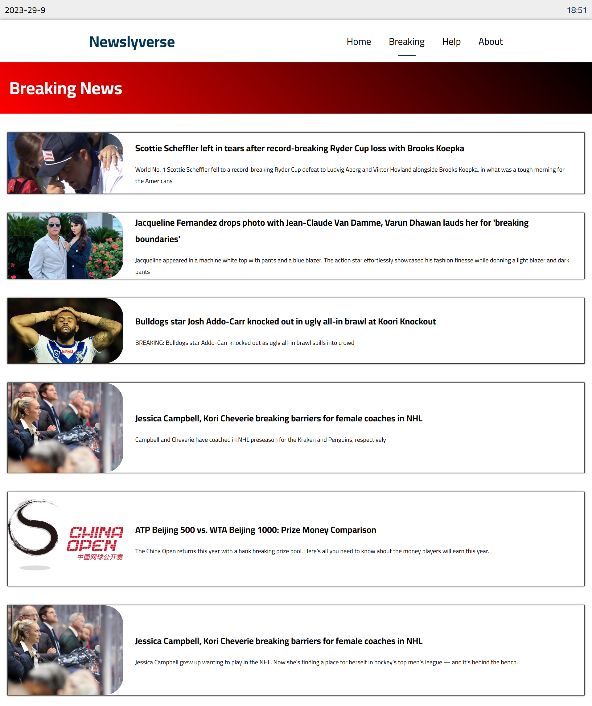

# Newslyverse Website

**Newslyverse** is a responsive news website with a user-friendly design that provides top headlines of the day and breaking news. It focuses on optimized performance and uses modern development practices.

## Features

- **Home Page:** Displays top headlines from various categories.
- **Breaking News Page:** Shows the latest articles from the last few hours.
- **Website Subscription:** Subscribe to the website, and it will automatically email you.
- **Responsive Design:** Works seamlessly on all devices.
- **Optimized Data Fetching**: For seamless and efficient user experience.

## Tools and Technologies Used

Newslyverse utilizes:

- **HTML** (HTML5)
- **CSS** (CSS3)
- **JavaScript** (ES6)
- **Pug, Sass, and Gulp** for efficient development.
- **Ajax** for seamless data retrieval.

## Future Work

1. **About and Help Pages:** Planned for user information and support.
2. **Expand Backend API:** To include more news sources.
3. **Category-Specific Pages:** Individual pages for news categories.

## Screenshots

---

## 🚀 About Me

Junior Front-end developer with a history of creating engaging, user-friendly websites with proven success. Developed modern websites with advanced features, showcasing technical excellence. Motivated to stay up-to-date with industry trends and best practices. Aspiring to be a Full-stack developer with a strong determination and passion for coding.

## 🛠 Skills

- HTML(HTML5)
- CSS (CSS3)
- JavaScript
- EcmaScript 6
- Object Oriented Programming (OOP)
- Sass\SCSS
- Pug
- GulpJs
- BootStrap
- Material UI
- React.js
- React ecosystems (React Router - React Redux - React Query)
- Redux (with Redux Toolkit)
- Firebase (Firebase Realtime database - Firebase Authentication)

## 🔗 Links

